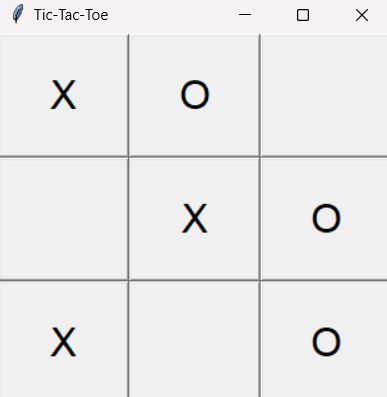

# Tic_Tac_Toe

This Python program implements a Tic-Tac-Toe game with a graphical interface using the Tkinter library. The game is designed for two players to play on the same computer by clicking buttons representing the cells of the Tic-Tac-Toe grid.

Key Features
Player Interaction:

Players take turns to click on empty cells.
Player "X" starts the game, followed by player "O".
Graphical Interface:

The game uses a 3x3 grid of buttons as the board.
Each button updates its text to display the player's symbol ("X" or "O") when clicked.
Game Logic:

The program checks for a winner after each move by evaluating rows, columns, and diagonals.
If a winner is found, a popup message is displayed declaring the winner.
Draw Detection:

If all cells are filled and no player has won, the game declares a draw.
Game Reset:

After a win or draw, the game board is reset for a new game.
Error Handling:

Clicking on an already occupied cell has no effect, preventing invalid moves.
Code Components
Class Initialization (__init__):

Sets up the initial game board and creates a 3x3 grid of Tkinter buttons.
Initializes variables to track the current player and the state of the game board.
make_move(row, col):

Handles a player's move.
Updates the board and button text for the chosen cell.
Checks for a winner or draw and displays an appropriate message.
Switches the current player if the game continues.
check_winner():

Checks all rows, columns, and diagonals for a win condition (three identical symbols).
Returns True if the current player wins.
check_draw():

Verifies if all cells are filled without a winner.
Returns True if the game is a draw.
reset_board():

Clears the game board and resets all buttons for a new game.
Sets the current player back to "X".
Main Functionality:

Creates a Tkinter window and initializes the TicTacToe class.
Runs the Tkinter main event loop (root.mainloop()) to keep the window responsive.
How It Works
Start the Game:

The Tkinter window opens with a 3x3 grid of buttons.
Players Take Turns:

Player X clicks on an empty cell, and the button displays "X".
Player O then clicks on an empty cell, and the button displays "O".
Win or Draw Detection:

After each move, the program checks for a win or draw:
If a player wins, a popup announces the winner.
If the board is full with no winner, a popup announces a draw.
Reset:

After a game finishes, the board resets for a new round.